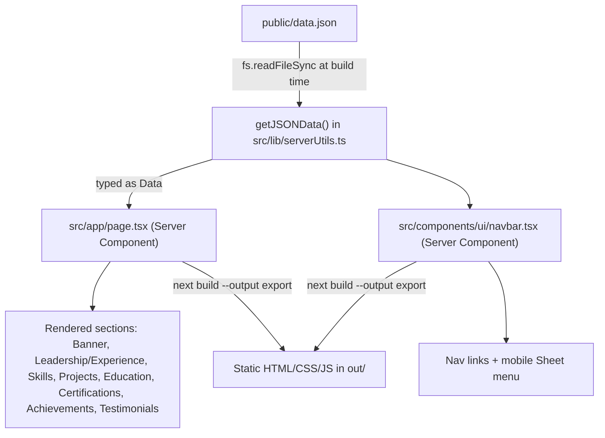

   # Implementation Notes — Janushikha's Portfolio

This document explains (1) why the image bug slipped through earlier
commits, (2) what every file in this repo is responsible for, (3) how
the site is built and deployed, and (4) practical notes for maintaining
it going forward.

---

## 1. Why the broken-images bug wasn't caught earlier

Short version: **the bug has existed since `basePath` support was added
in the `feat:build gh page` commit — it just never surfaced until you
looked at the actual deployed URL with real content in it.**

Why it stayed hidden:

- **`npm run dev` and a plain `npm run build` never set `NEXT_BASE_PATH`.**
  That variable is only injected by the GitHub Actions workflow, in the
  `configure-pages` step, at deploy time. Every local check — including
  the ones run during this session before the fix — used a plain
  `npm run build`, which produces a site with *no* basePath, so image
  paths like `/assets/project_1.jpeg` were correct in that context and
  looked completely fine.
- **The bug only exists for project-style GitHub Pages sites**
  (`username.github.io/Portfolio`), because those need every internal
  URL prefixed with `/Portfolio`. A user/org page
  (`username.github.io` itself) is served from the domain root and
  never needs a basePath, so this class of bug wouldn't happen there at
  all.
- **Next's own JS/CSS files *do* get the basePath automatically**
  (via `assetPrefix` in `next.config.mjs`), so most of the site looked
  and worked correctly — text, links, styling, routing. Only asset
  `src` strings passed straight into `next/image` were affected, which
  is a narrow, easy-to-miss surface.
- **The specific trap:** this project sets `images: { unoptimized: true }`
  in `next.config.mjs` (required because static export has no server to
  run Next's image-optimization API at request time). When
  `unoptimized` is on, `next/image` skips its usual `/_next/image?...`
  loader — which is what normally gets the basePath rewrite applied —
  and instead renders a plain `` using exactly the
  string you gave it. Nothing rewrites that string, so any hardcoded
  `/assets/...` path silently breaks on a sub-path deployment.

**The fix:** [src/lib/utils.ts](src/lib/utils.ts) now exports
`withBasePath(path)`, which prefixes a root-relative path with
`process.env.NEXT_BASE_PATH` (the same variable the GitHub Actions
workflow already computes and injects at build time). It's applied to
every image `src` built from a data-driven path in
[src/app/page.tsx](src/app/page.tsx): the profile photo, each project
cover, and testimonial avatars.

---

## 2. Tech stack

| Layer | Choice |
|---|---|
| Framework | Next.js 14 (App Router), statically exported (`output: 'export'`) |
| Language | TypeScript |
| Styling | Tailwind CSS |
| UI primitives | shadcn/ui (Radix UI underneath) — Button, Card, Badge, Avatar, Sheet |
| Content | A single JSON file (`public/data.json`), no CMS/database |
| Hosting | GitHub Pages, deployed via GitHub Actions |
| Blog (MDX) | Removed in this session — infra (`@next/mdx`, `mdx-components.tsx`) still installed but unused |

There is **no backend**. Nothing runs at request time — the entire site
is pre-rendered once at build time into static HTML/CSS/JS in `out/`,
and GitHub Pages just serves those files.

---

## 3. Architecture — how a page render happens



Everything you see on the page — name, bio, every project, every
leadership entry, every certification — is data pulled from
`public/data.json` at build time. There's no client-side fetch: `page.tsx`
and `navbar.tsx` are **Server Components** (`async function`,
no `"use client"`), so `getJSONData()` runs in Node during the build and
the result is baked directly into the static HTML.

The only client-side interactive pieces are:
- `ThemeToggler` (`src/components/ui/themeToggler.tsx`) — dark/light
  mode, stored in `localStorage`.
- The mobile nav `Sheet` (slide-out menu) from shadcn/ui.

Everything else is inert static markup — no client JS is needed for the
content to render.

---

## 4. File-by-file reference

### Config
| File | Purpose |
|---|---|
| `next.config.mjs` | Enables MDX, sets `output: 'export'` (static site, no server), `trailingSlash: true`, and reads `NEXT_BASE_PATH` env var into `basePath`/`assetPrefix` for GitHub Pages sub-path hosting. Also sets `images.unoptimized: true` (required for static export). |
| `tailwind.config.ts` / `postcss.config.mjs` | Tailwind CSS setup and theme tokens (colors, dark mode class strategy). |
| `tsconfig.json` | TypeScript compiler options, `@/*` path alias → `src/*`. |
| `components.json` | shadcn/ui CLI config (where generated components go, style variant used). |
| `.eslintrc.json` | Lint rules (`next lint`). |

### Content & data layer
| File | Purpose |
|---|---|
| `public/data.json` | **The single source of truth for all content** — personal info, contact links, skills, projects, leadership/experience, education, certifications, achievements, hobbies, testimonials, and `visual` (nav links + which homepage sections are turned on/off). Edit this file to change what appears on the site — no code changes needed. |
| `src/types/data.ts` | TypeScript interfaces mirroring `data.json`'s shape (`Data`, `Project`, `WorkExperience`, `Certification`, `Achievement`, etc.). Keeps `data.json` and the components that read it in sync — if you add a field to one, TypeScript will flag the other. |
| `src/lib/serverUtils.ts` | `getJSONData()` — reads and `JSON.parse`s `public/data.json` from disk. Only callable from Server Components (uses Node's `fs`). |
| `public/assets/` | All images (profile photo, project covers, logo). Referenced by root-relative path (e.g. `/assets/project_1.jpeg`) in `data.json`. |

### Shared utilities
| File | Purpose |
|---|---|
| `src/lib/utils.ts` | `cn()` — shadcn's Tailwind class-merging helper. `withBasePath()` — new helper (added in this session) that prefixes a root-relative asset path with the GitHub Pages basePath so images resolve correctly both locally and when deployed under `/Portfolio`. |

### Pages / layout
| File | Purpose |
|---|---|
| `src/app/layout.tsx` | Root HTML shell — loads the Inter font, renders `<Navbar />`, the page content, and `<Footer />` on every route. |
| `src/app/page.tsx` | The entire homepage. Fetches data via `getJSONData()` and renders each section (Banner, Leadership & Experience, Skills, Projects, Education, Certifications, Achievements, Testimonials) — each wrapped in a check against `data.visual.home.sections.<name>` so any section can be hidden without deleting its data. |
| `src/app/globals.css` | Tailwind base layer + CSS custom properties for the light/dark color palette. |
| `src/mdx-components.tsx` | Next.js MDX convention file (required by `@next/mdx` if any `.mdx` page exists). Currently unused since the blog feature was removed, but harmless to leave. |

### UI components (`src/components/ui/`)
| File | Purpose |
|---|---|
| `navbar.tsx` | Fixed top header. Renders nav links from `data.visual.navbar.links`, includes `ThemeToggler`, and a mobile hamburger `Sheet` menu. The site title (your name) replaced the old template logo image in this session. |
| `footer.tsx` | Bottom bar with template attribution ("Logging Studio" / "ThemeWagon" — the original theme credit, still present). |
| `themeToggler.tsx` | Client component; toggles a `dark` class on `<body>`, persisted to `localStorage`. |
| `button.tsx`, `card.tsx`, `badge.tsx`, `avatar.tsx`, `sheet.tsx` | Presentational primitives generated by the shadcn/ui CLI (thin wrappers around Radix UI). Not hand-rolled business logic — safe to leave as-is. |

### CI/CD
| File | Purpose |
|---|---|
| `.github/workflows/nextjs-gh-pages.yml` | GitHub Actions workflow — builds and deploys the site to GitHub Pages on every push to `main`. Details below. |

---

## 5. How GitHub Actions deploys the site on every push

```mermaid
flowchart LR
    P[git push to main] --> T[Workflow triggers]
    T --> J1[Job: build]
    J1 --> S1[checkout code]
    S1 --> S2[setup-node@v4<br/>Node 20 + npm cache]
    S2 --> S3[configure-pages@v5<br/>computes base_path = /Portfolio]
    S3 --> S4[npm ci]
    S4 --> S5["npm run build<br/>(NEXT_BASE_PATH=/Portfolio)"]
    S5 --> S6[upload-pages-artifact@v3<br/>packages ./out]
    S6 --> J2[Job: deploy]
    J2 --> S7[deploy-pages@v5<br/>publishes to GitHub Pages CDN]
    S7 --> Live[janushikha.github.io/Portfolio is live]
```

Step by step:

1. **Trigger** — any push to `main` (or a manual "Re-run all jobs" /
   "workflow_dispatch" from the Actions tab).
2. **`build` job:**
   - `actions/checkout@v4` clones your repo into the runner.
   - `actions/setup-node@v4` installs Node 20 and caches `npm` deps
     based on `package-lock.json`, so repeat runs are faster.
   - `actions/configure-pages@v5` asks GitHub what this Pages site's
     base path should be. Since this is a **project page**
     (`Janushikha/Portfolio` → served at `janushikha.github.io/Portfolio/`,
     not at the domain root), it resolves to `/Portfolio`. This value is
     exposed as `steps.pages.outputs.base_path`.
   - `npm ci` — a clean, reproducible install from the lockfile (unlike
     `npm install`, it won't silently update dependency versions).
   - `npm run build`, with `NEXT_BASE_PATH` set to that computed
     `/Portfolio` value as an environment variable. This is what
     `next.config.mjs` reads to set `basePath`/`assetPrefix`, and now
     also what `withBasePath()` reads to fix up image `src`s. Output
     goes to `./out` because of `output: 'export'`.
   - `actions/upload-pages-artifact@v3` zips up `./out` and uploads it
     as a workflow artifact, ready for the deploy job.
3. **`deploy` job** (runs only if `build` succeeded, via `needs: build`):
   - Runs inside the special `github-pages` **environment** — this is
     why you see a URL and deployment history tracked in the repo's
     "Environments" tab, separate from a raw Actions log.
   - `actions/deploy-pages@v5` takes the uploaded artifact and publishes
     it to the GitHub Pages CDN. The live URL is exposed as
     `steps.deployment.outputs.page_url` and shown in the run summary.
4. **Concurrency control** — `group: "pages"` with
   `cancel-in-progress: false` means if you push twice in quick
   succession, the second run waits for the first to finish rather than
   cancelling it or racing it — deployments always complete in order.

Practically: **every push to `main` fully rebuilds and redeploys the
site**, usually live within 1–2 minutes. There's no separate "staging"
step — `main` is production.

---

## 6. Practical notes for future changes

- **To change any text/links/data:** edit `public/data.json` and
  push. No code change needed. This covers your bio, contact links,
  every project's description/tech list/repo links, leadership
  entries, education, certifications, achievements, and hobbies.
- **To add a new project image:** drop the file in `public/assets/`,
  then set that project's `cover` field in `data.json` to
  `/assets/<filename>` — `withBasePath()` already handles making the
  path work both locally and on GitHub Pages.
- **To hide/show a whole section** (Skills, Certifications,
  Achievements, Testimonials, etc.) without deleting its data, flip the
  matching boolean under `visual.home.sections` in `data.json`.
- **Local dev never uses a basePath.** `npm run dev` and a bare
  `npm run build` always behave as if the site is hosted at the domain
  root. If something looks right locally but breaks after a GitHub
  Pages deploy, a missing basePath prefix on some path is the first
  thing to check — the same class of bug as the image issue just
  fixed. To reproduce the deployed environment locally: `NEXT_BASE_PATH=/Portfolio npm run build` (on Windows PowerShell:
  `$env:NEXT_BASE_PATH="/Portfolio"; npm run build`), then inspect
  `out/index.html`.
- **Images are unoptimized** (`images.unoptimized: true` — required
  for static export, since there's no server to run Next's on-demand
  image resizing API). This means whatever file size/dimensions you
  upload to `public/assets/` is exactly what ships to visitors — worth
  compressing large photos yourself before adding them.
- **No server-side features are available**: no API routes, no server
  actions, no ISR/revalidation, no middleware that runs per-request.
  Everything must be resolvable at `next build` time. If you ever need
  a contact form, comments, or anything dynamic, it would need an
  external service (e.g. Formspree, a serverless function elsewhere) —
  GitHub Pages itself only serves static files.
- **Useful scripts** (from `package.json`): `npm run dev` (local dev
  server), `npm run build` (production build to `out/`), `npm run
  start` (serve the non-exported build — not used for this deployment
  method), `npm run lint` (ESLint via `next lint`).
